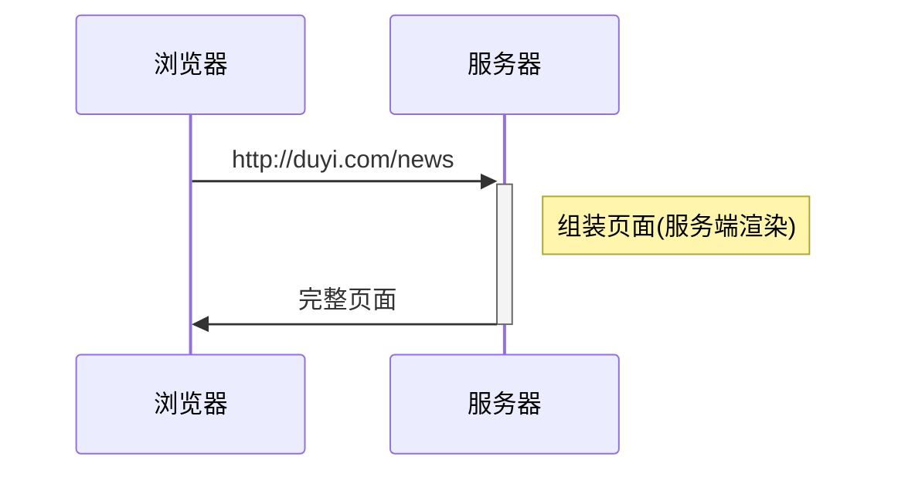
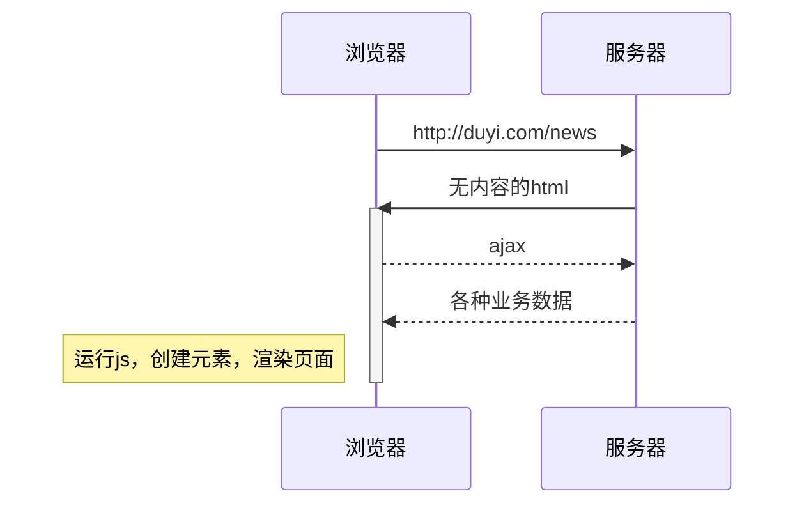

## Vue入门

### 前端框架的由来

> vue官网：https://cn.vuejs.org/

#### 服务端渲染



#### 前后端分离



### 核心概念

#### 注入


vue会将以下配置注入到vue实例：

- *data*：和界面相关的数据
- *computed*：通过已有数据计算得来的数据，将来详细讲解
- *methods*：方法


#### 虚拟dom树

直接操作真实的DOM会引发严重的效率问题，vue使用虚拟DOM（vnode）的方式来描述要渲染的内容

vnode是一个**普通的**JS对象，用于描述界面上应该有什么，比如：

```js
var vnode = {
  tag: "h1",
  children: [
    { tag: undefined, text: "第一个vue应用：Hello World"}
  ]
}
```

上面的对象描述了：

`有一个标签名为h1的节点，它有一个子节点，该子节点是一个文本，内容为「第一个vue应用：Hello World」`

**vue模板并不是真实的DOM，它会被编译为虚拟DOM**

```html
<div id="app">
  <h1>第一个vue应用：{{title}}</h1>
  <p>作者：{{author}}</p>
</div>
```

上面的模板会被编译为类似下面结构的虚拟DOM

```js
{
  tag: "div",
  children: [
    { tag: "h1", children: [ { text: "第一个vue应用：Hello World" } ] },
    { tag: "p", children: [ { text: "作者：袁" } ] }
  ]
}
```

虚拟DOM树会最终生成为真实的DOM树

 

当数据变化后，将引发重新渲染，*vue会比较新旧两棵vnode tree*，找出差异，然后仅把差异部分应用到真实dom tree中


**可见，在vue中，要得到最终的界面，必须要生成一个vnode tree**

vue通过以下逻辑生成vnode tree：

 

**注意：虚拟节点树必须是单根的**


#### 挂载

将生成的真实DOM树，放置到某个元素位置，称之为**挂载**

挂载的方式：

1. 通过`el:"css选择器"`进行配置
2. 通过`vue实例.$mount("css选择器")`进行配置

#### 完整流程


### 开发环境

- 快速创建vue模板

  vscode-->userSnappets-->vue.json

  增加一项配置

  ```json
  "Print to console": {
      "prefix": "vue2",  
      "body": [
        "<template>",
        "  <div$1>\n",
  			"  </div>",
        "</template>",
        "",
        "<script>",
        "  export default {",
        "    data() {",
        "      return {",
        "        ",
        "      }",
        "    },",
        "    //生命周期 - 创建完成（访问当前this实例）",
        "    created() {",
        "      ",
        "    },",
        "    //生命周期 - 挂载完成（访问DOM元素）",
        "    mounted() {",
        "      ",
        "    }",
        "  }",
        "</script>",
        "<style scoped>",
        "  /* @import url(); 引入css类 */",
  			"  ",
        "</style>"
      ],
      "description": "Log output to console"
    }
  ```

  后再vue文件中输入vue2就能直接使用模板

### 组件

**组件的出现是为了实现以下两个目标：**

1. 降低整体复杂度，提升代码的*可读性和可维护性*
2. 提升局部代码的*可复用性*

绝大部分情况下，一个组件就是页面中某个区域，组件包含该区域的：

- 功能（JS代码）

- 内容（模板代码）

- 样式（CSS代码）

  > 要在组件中包含样式，需要构建工具的支撑

#### 组件开发

##### 创建组件

组件是根据一个普通的配置对象创建的，所以要开发一个组件，只需要写一个配置对象即可

该配置对象和vue实例的配置是**几乎一样**的

```js
//组件配置对象
var myComp = {
  data(){
    return {
      // ...
    }
  },
  template: `....`
}
```

值得注意的是，组件配置对象和vue实例有以下几点差异：

- 无`el`
- `data`必须是一个函数，该函数返回的对象作为数据
- 由于没有`el`配置，组件的虚拟DOM树必须定义在`template`或`render`中

##### 注册组件

注册组件分为两种方式，一种是**全局注册**，一种是**局部注册**

**全局注册**

一旦全局注册了一个组件，整个应用中任何地方都可以使用该组件

 

全局注册的方式是：

```js
// 参数1：组件名称，将来在模板中使用组件时，会使用该名称
// 参数2：组件配置对象
// 该代码运行后，即可在模板中使用组件
Vue.component('my-comp', myComp)
```

> 但在一些工程化的大型项目中，很多组件都不需要全局使用。
> 比如一个登录组件，只有在登录的相关页面中使用，如果全局注册，将导致构建工具无法优化打包
> **因此，除非组件特别通用，否则不建议使用全局注册**

**局部注册**

局部注册就是哪里要用到组件，就在哪里注册


局部注册的方式是，在要使用组件的组件或实例中加入一个配置：

```vue
// 这是另一个要使用my-comp的组件
var otherComp = {
  components:{
    // 属性名为组件名称，模板中将使用该名称
    // 属性值为组件配置对象
    "my-comp": myComp
  },
  template: `
    <div>
      <!-- 该组件的其他内容 -->
      <my-comp></my-comp>
    </div>
  `;
}
```

##### 应用组件

在模板中使用组件特别简单，把组件名*当作HTML元素名*使用即可。

但要注意以下几点：

1. **组件必须有结束**

组件可以自结束，也可以用结束标记结束，但必须要有结束

2. *组件的命名*

   组件可以使用`kebab-case 短横线命名法`，也可以使用`PascalCase 大驼峰命名法`

   使用`PascalCase`方式命名还有一个额外的好处，即可以在模板中使用两种组件名

   ```vue
   var otherComp = {
     components:{
       MyComp: myComp
     }
   }
   // 模板中
   <!-- 可用 -->
   <my-comp />
   <MyComp />
   ```


#### 组件树

一个组件创建好后，往往会在各种地方使用它。它可能多次出现在vue实例中，也可能出现在其他组件中。

于是就形成了一个组件树

 

#### 向组件传递数据

大部分组件要完成自身的功能，都需要一些额外的信息

比如一个头像组件，需要告诉它头像的地址，这就需要在使用组件时向组件传递数据

传递数据的方式有很多种，最常见的一种是使用**组件属性 component props**

首先在组件中*声明*可以接收哪些属性:

```js
var MyComp = {
  props:["p1", "p2", "p3"],
  // 和vue实例一样，使用组件时也会创建组件的实例
  // 而组件的属性会被提取到组件实例中，因此可以在模板中使用
  template: `
    <div>
      {{p1}}, {{p2}}, {{p3}}
    </div>
  `
}
```

*使用组件时*, 向其传递属性

```js
var OtherComp = {
  components: {
    MyComp
  },
  data(){
    return {
      a:1
    }
  },
  template: `
    <my-comp :p1="a" :p2="2" p3="3"/>
  `
}
```

**注意：在组件中，属性是只读的，绝不可以更改，这叫做单向数据流**

 


### 工程搭建

#### Vue-cli

`vue-cli`是一个脚手架工具，用于搭建`vue`工程

它内部使用了`webpack`，并预置了诸多插件（`plugin`）和加载器（`loader`），以达到开箱即用的效果

除了基本的插件和加载器外，`vue-cli`还预置了：

- babel
- webpack-dev-server
- eslint
- postcss
- less-loader

#### SFC

*单文件组件*，Single File Component，即一个文件就包含了一个组件所需的全部代码

```vue
<template>
	<!-- 组件模板代码 -->
</template>

<script>
export default {
  // 组件配置
}
</script>

<style>
	/* 组件样式 */
</style>
```

#### 预编译

当`vue-cli`进行**打包**时，会直接把组件中的模板转换为`render`函数，这叫做模板预编译

这样做的好处在于：

1. *运行时*就不再需要编译模板了，提高了运行效率
2. *打包结果*中不再需要vue的编译代码，减少了打包体积


### 计算属性

**计算属性和方法的区别**

> 计算属性本质上是包含 *getter和setter* 的方法
> 当获取计算属性时，实际上是在调用计算属性的getter方法。vue会收集计算属性的依赖，并*缓存*计算属性的返回结果。只有当*依赖变化后才会重新进行计算*。
>
> *方法没有缓存*，每次调用方法都会导致重新执行。
>
> 计算属性的getter和setter参数固定，getter没有参数，setter只有一个参数。而方法的参数不限。
>
> 由于有以上的这些区别，因此计算属性通常是根据已有数据得到其他数据，并在得到数据的过程中不建议使用异步、当前时间、随机数等副作用操作。
>
> 实际上，他们最重要的区别是*含义上的区别*。计算属性含义上也是一个数据，可以读取也可以赋值；方法含义上是一个操作，用于处理一些事情。

**完整的计算属性书写**

```js
computed: {
  propName: {
    get(){
      // getter
    },
    set(val){
      // setter
    }
  }
}
```

**计算属性简写（只包含getter）**

```js
computed: {
  propName(){
    // getter
  }
}
```


### 样式作用域

父组件可以影响子组件的样式     


### 组件事件

 

抛出事件：子组件在某个时候发生了一件事，但自身无法处理，于是通过事件的方式通知父组件处理

事件参数：子组件抛出事件时，传递给父组件的数据

注册事件：父组件申明，当子组件发生某件事的时候，自身将做出一些处理

### v-if v-show

**v-if 和 v-show的区别**

> v-if能够*控制是否生成vnode*，也就间接控制了是否生成对应的dom。当v-if为true时，会生成对应的vnode，并生成对应的dom元素；当其为false时，不会生成对应的vnode，自然不会生成任何的dom元素。
> v-show*始终会生成vnode*，也就间接导致了始终生成dom。它只是控制dom的*display*属性，当v-show为true时，不做任何处理；当其为false时，生成的dom的display属性为none。
> 使用v-if可以有效的减少树的节点和渲染量，但也会导致树的不稳定；而使用v-show可以保持树的稳定，但不能减少树的节点和渲染量。
> 因此，在实际开发中，显示*状态变化频繁的情况下应该使用v-show*，以保持树的稳定；*显示状态变化较少时应该使用v-if*，以减少树的节点和渲染量。